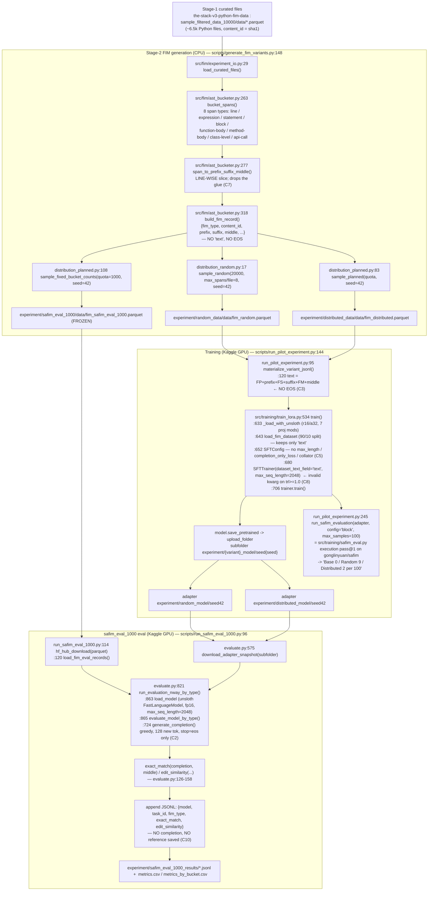

# Python FIM Evaluation Audit

> Evidence-backed audit of the repository `qwen2.5-coder-0.5b-python-fim` (branch `feat/data`,
> HEAD `aa538f2`). Produced by static code inspection plus non-destructive CPU/tokenizer/dataset
> checks. **No training was run, no full 1000-example evaluation was run, nothing was modified,
> pushed, or deleted.** Model-weight-dependent claims that could not be reproduced without a GPU are
> marked **REQUIRES RUNTIME VERIFICATION**.
>
> Every finding cites `file:line`, the function/class, and a confidence level (HIGH / MEDIUM / LOW).

---

## 1. Executive Summary

**Is the current evaluation trustworthy?** **No.** The `safim_eval_1000` results that produced
`exact_match = 0.000` for all three models are affected by at least four independent defects, any one
of which is enough to drive exact-match to zero regardless of model quality. They are not a
measurement of the models.

**Can we conclude fine-tuning failed?** **No — and we also cannot conclude it succeeded.** The eval
cannot currently distinguish "the model is bad" from "the harness is broken" because per-example
predictions are never saved and the one CPU reproduction we could do contradicts the published
numbers.

**The 3–5 most important problems:**

1. **The published `safim_eval_1000` numbers are not reproducible from the committed code.** Running
   the exact committed `generate_completion` path (greedy, `max_new_tokens=128`, stop on
   `eos_token_id`) against the *frozen* eval parquet on CPU/plain-HF gives the **base** model
   correct, EOS-terminated completions and **non-zero** exact-match on easy `line`/`statement` tasks —
   yet `experiment/safim_eval_1000_results/Base.jsonl` reports `exact_match = 0.0` on **all 1000
   rows** and a uniform ~0.02–0.23 edit-similarity. The Kaggle eval run (unsloth + fp16 + T4) was
   very likely broken at runtime. (CRITICAL, MEDIUM-HIGH confidence — CPU repro was 3 rows; needs a
   GPU repro.)
2. **The evaluation has no adequate stop / truncation rule.** `generate_completion`
   (`src/training/evaluate.py:97-120`) decodes up to 128 tokens, stops **only** on
   `tokenizer.eos_token_id` (id 151643), and never truncates the prediction to the target span. The
   six other Qwen FIM stop tokens (`<|fim_prefix|>` … `<|file_sep|>`, ids 151659–151664) are declared
   `"special": false` in the tokenizer, so `skip_special_tokens=True` does **not** remove them and
   they are not stop signals. Any model that emits the right middle and then keeps going — or emits
   `<|file_sep|>`/`<|fim_pad|>` as its natural FIM terminator — scores `exact_match = 0`. (CRITICAL,
   HIGH confidence for the config gap.)
3. **`exact_match` is the wrong headline metric for this dataset.** It is `predicted.strip() ==
   reference.strip()` (`evaluate.py:126-128`): exact character equality, no whitespace collapse, no
   formatting/AST normalisation. 43 % of the 1000 eval tasks ask for a whole multi-statement body
   reproduced verbatim; 6.5 % have a reference longer than the 128-token generation cap and are
   *impossible* by construction. `return  x` and `x = [1, 2, 3]` both score 0 against `return x` /
   `x = [1,2,3]`. A uniform ~0.000 is the metric's expected behaviour here, not proof of a broken
   model. (HIGH confidence.)
4. **Training degraded the model's FIM stopping and diluted the FIM signal.** Training text ends at
   `{middle}` with **no EOS** (`scripts/run_pilot_experiment.py:120`); the tokenizer does not
   auto-append one; loss is over the whole prefix+suffix+middle sequence (no completion-only masking),
   so for a median example ~1 % of the gradient is on the target; and because the target sits at the
   end of the string, right-side truncation deletes the entire `middle` in 13–47 % of training rows
   (depending on the effective cap). A CPU check shows Random-LoRA repeating and never stopping where
   the base model cleanly emits `return a + b<|endoftext|>`. (HIGH confidence for the mechanism;
   exact production numbers REQUIRE RUNTIME VERIFICATION of the Kaggle TRL/unsloth build.)
5. **The two LoRA adapters are effectively identical.** Mean per-tensor weight-norm difference
   between `experiment/random_model/seed42` and `experiment/distributed_model/seed42` is 0.011
   (against tensor norms of 0.15–3.3); global Frobenius norm 39.55 vs 39.37. The random-vs-planned
   pilot contrast is within noise; the ~0.003 edit-similarity gap between them is meaningless.
   (HIGH confidence.)

Bonus: the "earlier 100-task eval: Base 0 / Random 9 / Distributed 2" was **execution pass@1 on the
real `gonglinyuan/safim` `block` subset** (`src/training/safim_eval.py`), a different metric on a
different dataset. "9/100 → 0/1000" is a metric+dataset switch, **not** a regression.

**Should we train more models right now?** **No.** Fix the evaluation, save predictions, and run the
40-task diagnostic (Section 18) before spending any more GPU on training.

**Overall confidence:** HIGH that the current evaluation is untrustworthy and that fine-tuning cannot
be judged from it. MEDIUM on the precise ranked cause of the all-zero exact-match, because the
Kaggle GPU/unsloth path was not reproducible in this audit.

---

## 2. Repository / Experiment Snapshot

| Item | Value | Source |
|---|---|---|
| Branch | `feat/data` | `git status` |
| HEAD commit | `aa538f2707351740ceb90cc507f997effcf7a7ab` — "fix: t4 issue" | `git rev-parse HEAD` |
| Working tree | Clean except two **untracked** paths: `prompts/`, `reports/safim_eval_1000_code_reference.md`. No modified tracked files. | `git status --porcelain` |
| Recent relevant commits | `fef8967` pin safim_eval_1000 to a single GPU (T4x2 device-mismatch crash); `8f4a0fe` force-regenerate safim_eval_1000 (first push landed an empty set); `320b0ae` set FORCE_REGENERATE back to False; `3f715bd` safim_eval_1000 fixed set + continue eval pool from 10k checkpoint | `git log` |
| Base model | `Qwen/Qwen2.5-Coder-0.5B` | `configs/data/safim_eval_1000.yaml` `evaluation.base_model_name` |
| Adapter repo | `Rudra-G-23/qwen2.5-coder-0.5b-python-fim` (HF, type `model`) | `configs/training/lora.yaml` `output.hf_repo_id` |
| Random-LoRA | adapter subfolder `experiment/random_model/seed42` | `configs/data/safim_eval_1000.yaml` `evaluation.models[1]` |
| Distributed-LoRA | adapter subfolder `experiment/distributed_model/seed42` | `configs/data/safim_eval_1000.yaml` `evaluation.models[2]` |
| Only seed present on HF | `seed42` (pilot config declares seeds `[42, 123, 7]`) | `configs/training/pilot.yaml`; `HfApi.list_repo_files` |
| Training FIM data | `Rudra-G-23/the-stack-v3-python-fim-data` → `experiment/random_data/data/fim_random.parquet` (20 000), `experiment/distributed_data/data/fim_distributed.parquet` (20 000) | `src/fim/experiment_io.py`, cached parquet |
| Eval set | same repo → `experiment/safim_eval_1000/data/fim_safim_eval_1000.parquet` (1000 rows, fixed) | `scripts/generate_safim_eval_1000.py` |
| Published eval results | same repo → `experiment/safim_eval_1000_results/{Base,Random-LoRA,Distributed-LoRA}.jsonl` (1000 rows each) | HF cache |
| Training seed / data seed | `42` / `42` | `configs/training/lora.yaml` `seed`; `configs/data/*.yaml` `sampling.seed` |
| LoRA config | `r=16`, `alpha=32`, `dropout=0.05`, `bias=none`, targets `{q,k,v,o,gate,up,down}_proj`, `num_epochs=1`, eff. batch 16, `lr=2e-4`, cosine, warmup 50, fp16, `max_seq_length=2048` | `configs/training/lora.yaml`; adapter `adapter_config.json` |
| `train_loss_final` | Random `0.8232`, Distributed `0.4296` | adapter `metadata.json` per subfolder |
| Key configs | `configs/training/lora.yaml`, `configs/training/pilot.yaml`, `configs/data/safim_eval_1000.yaml`, `configs/data/fim_distribution.yaml`, `configs/data/stack_v3_eval_pool_no_fim.yaml` | — |

Audit environment: local `.venv` has `trl 1.9.2`, `transformers 5.14.1`, `peft 0.20.0`,
`torch 2.13.0+cu130`, no `unsloth`, no GPU. The Kaggle training/eval notebooks install
`unsloth[colab-new] @ git+…`, `trl>=0.17.0`, `transformers>=5.0.0`, `peft>=0.20.0` — **unpinned**, and
load-bearing for several conclusions below.

---

## 3. End-to-End Pipeline



**Two evaluations exist and must not be conflated:**

| | Earlier "9/100" | Current "0/1000" |
|---|---|---|
| Script | `scripts/run_pilot_experiment.py:245` → `src/training/safim_eval.py:run_safim_evaluation` | `scripts/run_safim_eval_1000.py` → `src/training/evaluate.py:run_evaluation_nway_by_type` |
| Dataset | `gonglinyuan/safim`, `config="block"`, `lang=="python"`, shuffled(seed), first 100 | custom `experiment/safim_eval_1000` parquet, 1000 rows, 8 buckets |
| Metric | **execution pass@1** (`python -c program`, stdin/stdout vs unit tests) | **string `exact_match`** (primary) + `edit_similarity` |
| Generation | same `generate_completion` (greedy, 128, stop=eos) | same `generate_completion` |

---

## 4. Confirmed Correct Components

| Component | Evidence | File / path | Why it is fine |
|---|---|---|---|
| FIM sentinel **ordering** (PSM) train vs eval | `scripts/run_pilot_experiment.py:120` `text=FP+prefix+FS+suffix+FM+middle`; `src/training/evaluate.py:108` prompt `=FP+prefix+FS+suffix+FM` | `data_prep.py:17-19`, `evaluate.py:47-49` | Byte-identical up to `<|fim_middle|>`; no stray whitespace, no duplicated/missing sentinels. PSM everywhere. |
| Tokenizer special-token handling | `AutoTokenizer.from_pretrained("Qwen/Qwen2.5-Coder-0.5B")` probe: `<|fim_prefix|>`=151659, `<|fim_middle|>`=151660, `<|fim_suffix|>`=151661, `<|fim_pad|>`=151662, `<|repo_name|>`=151663, `<|file_sep|>`=151664, `<|endoftext|>`=151643 (eos **and** pad) | tokenizer config | Each sentinel is one native id. `add_bos_token=false`, `add_eos_token=false`; `tokenizer(s)` == `tokenizer(s, add_special_tokens=False)`. Repo never calls `add_tokens`/`resize_token_embeddings` (grep clean) → no double-add, no vocab resize. |
| `add_special_tokens` skew train↔eval | training uses `add_special_tokens=False`; inference uses default `True` | `evaluate.py:109` | Harmless: Qwen2Tokenizer adds no BOS/EOS either way; token-id counts identical on all 1000 eval prompts (verified). |
| Eval-set **bucket quotas** | `Counter(fim_type)` over the 1000 rows == config quotas exactly, zero shortfall: line 150 / statement 150 / expression 150 / block 120 / function-body 120 / method-body 100 / api-call 120 / class-level 90 | `configs/data/safim_eval_1000.yaml:31-40`; `reports/experiment_safim_eval_1000_metadata.json` | Distribution is exactly as configured. No stray `fim_type`. |
| **No train/eval source-file leakage** | `content_id` (sha1 of file content) intersection: Random-train ∩ eval = **0**; Distributed-train ∩ eval = **0**; (Random ∪ Distributed) ∩ eval = **0** | eval + both training parquets, `content_id` column | Stream-continuation design in `configs/data/stack_v3_eval_pool_no_fim.yaml` holds — every eval file is hash-disjoint from the 10k pilot pool. |
| **No identical FIM triples** train↔eval | `(prefix, suffix, middle)` exact-triple intersection = **0** for both variants. 41 shared bare `middle` strings, all inspected = boilerplate (`import sys`, `pass`, `return result`, Django idioms). | same | No meaningful contamination. |
| All 3 models scored on the **same 1000 tasks** | eval parquet downloaded once (`run_safim_eval_1000.py:114`), `test_records` built once (`:120`), same list looped over 3 model configs (`evaluate.py:856-877`); `max_samples=null` → all 1000; resume keyed on `task_id` | `run_safim_eval_1000.py`, `evaluate.py` | Paired by construction — good for future paired stats. |
| LoRA adapters exist and are non-trivially trained | `adapter_config.json` + `adapter_model.safetensors` (336 tensors, ~44.5 MB) present for both `seed42` subfolders; LoRA-B norms non-zero (random mean 0.881, distributed mean 0.875 — B inits to 0) | HF cache | Adapters are real, downloadable, and did update during training. (They are just nearly identical to each other — see §14.) |
| Adapter **is active** at inference | CPU check (plain-HF path): base vs Random-LoRA on one FIM prompt → logits differ by L2 ≈ 648, top-1 token flips | `evaluate.py:55-94` `load_model` | `PeftModel.from_pretrained` activates the default adapter; no silent base fallback, no double-merge. |
| Metric math is internally correct | `edit_similarity` = hand-rolled Levenshtein DP, `1 − dist/max(m,n)`; verified symmetric, range [0,1], identical→1.0, disjoint→0.0, empty-ref handled | `evaluate.py:131-158` | The formula is a valid normalised edit similarity. (Its *fitness for purpose* is the problem — §11.) |

---

## 5. Confirmed Problems

| Severity | Problem | Evidence | Impact | Confidence |
|---|---|---|---|---|
| **CRITICAL** | Published `safim_eval_1000` results not reproducible from committed code | `experiment/safim_eval_1000_results/*.jsonl` = EM 0.000 on **all** 3000 rows, edit-sim uniform ~0.02–0.23; CPU repro of `evaluate.generate_completion` on frozen parquet rows 0 (`line`) & 150 (`statement`) → base emits correct middle, stops on `<|endoftext|>`, **EM True** | Every published number and every model-to-model comparison is invalid. The Kaggle run was broken at runtime. | MEDIUM-HIGH (repro was 3 rows, CPU/plain-HF; GPU/unsloth repro needed) |
| **CRITICAL** | Eval has no adequate stop / truncation | `evaluate.py:97-120`: `max_new_tokens=128`, `eos_token_id` only; no `StoppingCriteria`, no `stop_strings`, no per-`fim_type` truncation, no first-newline stop. `<|fim_*|>`/`<|repo_name|>`/`<|file_sep|>` are `"special": false` → not stripped, not stop tokens | Any non-self-terminating model → EM 0 everywhere; also explains earlier Base 0/100 pass@1 | HIGH (config gap); MEDIUM (that models actually over-generate here — RUNTIME) |
| **HIGH** | `exact_match` unfit as headline metric | `evaluate.py:126-128` strict `.strip()` equality; cases `return  x`→0, `[1, 2, 3]`→0 (executed). 43 % of tasks = whole multi-statement body verbatim; **65/1000 refs > 128 tokens** (impossible under the cap) | Uniform ~0.000 is the metric's expected output here, independent of model quality; erases the real signal | HIGH |
| **HIGH** | Training targets carry no EOS; fine-tune unlearned stopping | training text ends at `{middle}` (`run_pilot_experiment.py:120`, `data_prep.py:78`); tokenizer never auto-appends EOS (verified). CPU: Random-LoRA repeats, never stops, where base emits `return a + b<|endoftext|>` | LoRA models genuinely worse at FIM stopping than base → EM 0, low edit-sim | MEDIUM-HIGH (Kaggle TRL/unsloth EOS behaviour unverified — RUNTIME) |
| **HIGH** | Loss over whole sequence, not the middle | `train_lora.py:652-688`: no `completion_only_loss`, no completion collator, no `formatting_func`. Median `middle` = 10–16 tok of ~950 total | ~1 % of gradient trains the FIM target; ~99 % re-teaches LM-ing the given prefix/suffix. FIM signal massively diluted | HIGH |
| **HIGH** | Right-side truncation destroys training targets | `middle` (+ any EOS) is last in `text`; TRL truncates from the end. Measured on both parquets (300-row sample): whole `middle` truncated away in **13–15 %** of rows @ cap 2048, **40–47 %** @ cap 1024 (`SFTConfig.max_length` default in `trl 1.9.2`; `max_seq_length` passed as an *unsupported* `SFTTrainer` kwarg) | 1-in-7 to 2-in-5 training rows have zero/garbled target | HIGH (mechanism + lengths); MEDIUM (which cap was live — RUNTIME) |
| **HIGH** | ~12 % of eval prompts exceed the model's configured context | eval PSM-prompt token lengths (measured on frozen parquet): p90 2148, p95 2706, **max 3261**; `load_model` passes `max_seq_length=2048` to unsloth (`evaluate.py:73-77`); `generate_completion` tokenises with **no truncation** (`evaluate.py:109`). Prompt-only >2048: **12.3 %**; prompt+128 >2048: **14.7 %** | ~1 in 8 tasks feed an over-long prompt → unsloth error or silent left-truncation of the trailing `<|fim_suffix|>…<|fim_middle|>` (destroys the completion) | HIGH (lengths); MEDIUM (effect — RUNTIME) |
| **HIGH** | No per-task persistence of predictions / references | `evaluate.py:725-732` writes only `{model, task_id, fim_type, exact_match, edit_similarity}`; the `completion` string (`:724`) is discarded. `safim_eval.py:160-166` saves only `{model, task_id, "pass@1"}` | EM 0 / edit-sim 0.14 cannot be attributed to model vs harness without a full re-run. Repo's own doc calls this a "code gap" (`reports/safim_eval_1000_code_reference.md:307-329`) | HIGH |
| **HIGH** | Two variant adapters are effectively identical | safetensors comparison: mean per-tensor `|‖R‖−‖D‖|` = **0.011** (tensor norms 0.15–3.3); global Frobenius 39.55 vs 39.37; distinct sha256 but <0.5 % apart, despite `train_loss_final` 0.82 vs 0.43 | Random-vs-Distributed pilot cannot show a real effect; the ~0.003 edit-sim gap is noise | HIGH |
| **MEDIUM** | "9/100 → 0/1000" is a metric+dataset switch, not a regression | 9/100 = execution pass@1 on `gonglinyuan/safim` block (`safim_eval.py:159`; `artifacts/experiments/random/wandb-summary.json` `eval/safim/lora_ft/pass_at_1: 0.09`, `base: 0`). 0/1000 = string EM on custom set | The apparent "collapse" is illusory; both signals are weak-but-positive for LoRA once read correctly | HIGH |
| **MEDIUM** | `safim_eval_1000` is **not** official SAFIM | built from this repo's own Stack-v3 curated files (`configs/data/safim_eval_1000.yaml:14-16`), repo's own 8-bucket AST taxonomy (`src/fim/ast_bucketer.py:6-8`), scored by string metrics only — no execution, no unit tests, no syntax-aware truncation. `logs/EVAL_PROMPT.md:87-88`: "Real SAFIM … is not part of this workflow." | The name misrepresents a bespoke string-match set as the published execution benchmark; "SAFIM pass@1" in reports is misleading | HIGH |
| **MEDIUM** | Per-bucket scores confounded by target length | measured mean `middle` tokens: `line` 10.3 → `function-body` 101.8 (~10×). `block`/`function-body`/`method-body` have 13–27 % of their refs over the 128 cap | `plot_comparison_by_bucket` output reads length effects as span-type skill | HIGH |
| **MEDIUM** | `edit_similarity` collapses under over-generation | denominator `max(len_p, len_r)` (`evaluate.py:154`): 8-char ref vs 378-char over-gen → **0.021**; correct 3-line middle + ~60 trailing chars → **0.544** (executed) | A low edit-sim cannot be read as "output unrelated to reference" without the saved predictions | HIGH |
| **MEDIUM** | `train_lora.py` as committed cannot run on the notebooks' declared stack | `SFTTrainer(tokenizer=…, dataset_text_field=…, max_seq_length=…)` is invalid for `trl>=~1.0` / installed 1.9.2 (`inspect.signature` has no such params, no `**kwargs`). Training only ran via unsloth's patched `SFTTrainer`, whose EOS/truncation/label behaviour is unverified and unpinned | The whole training-target analysis has a version-dependent branch; reproducibility is not pinned | HIGH (signature); MEDIUM (impact) |
| **LOW** | Dropped newline glue in FIM slicing | `ast_bucketer.py:290-295`: `prefix = "\n".join(lines[:start])` / `suffix = "\n".join(lines[end:])` discard the `\n` between prefix↔middle and middle↔suffix. Measured: prefix lacks trailing `\n` in ~86–92 % of rows; `prefix+middle+suffix != source` | Non-idiomatic; a base FIM model reads the broken join as "mid-line, keep going" and rarely stops after one line. Train↔eval mutually consistent (same function), so a data-quality bug, not a skew | HIGH |
| **LOW** | Ollama deploy template sends empty suffix | `src/convert_gguf.py:145`: `TEMPLATE "<|fim_prefix|>{{ .Prompt }}<|fim_suffix|><|fim_middle|>"` — whole user prompt → prefix, suffix always empty | Deploy-only divergence from train/eval PSM shape. Its stop list (`<|endoftext|>` + 3 FIM sentinels) is *better* than the eval harness's | HIGH |
| **LOW** | Minor within-eval redundancy | 6 exact-duplicate `(prefix,suffix,middle)` triples; 15 duplicate-`middle` groups (18 extra rows); only 422 distinct source files back the 1000 tasks (37 files contribute the full 6 spans) | Net ≈ 994 distinct tasks; negligible | HIGH |
| **LOW** | Eval composition favours the Distributed arm | eval is 43 % structural-bucket tasks (matches the planned/Distributed training mix); Random-LoRA trained on only 4.6 % structural spans | Baked-in disadvantage for Random, independent of model quality | MEDIUM |

### Expanded notes on the top problems

**CRITICAL — results not reproducible (C1).** `experiment/safim_eval_1000_results/Base.jsonl` row 0
(`safim_eval_0000`, `line`) records `exact_match 0.0`, `edit_similarity 0.0244`. Running the committed
`evaluate.generate_completion` (same prompt string, greedy, `max_new_tokens=128`,
`eos_token_id=151643`) against that exact parquet row on CPU/plain-HF:

```
safim_eval_0000  (line)         -> "\n        done = False"                 stop=EOS (6 new tok)   EM=True
safim_eval_0150  (statement)    -> "\nprint('jane 학점:', jane)"            stop=EOS (13 new tok)  EM=True
safim_eval_0600  (function-body)-> "\n    return render_template('index.html')" stop=EOS          EM=False (genuinely hard)
```

The base model self-terminates and gets easy tasks right when the committed code is run directly. The
published all-zero column therefore reflects a broken Kaggle run, not the code in the repo and not the
base model. Prime suspects (Section 6 ranks them): the `unsloth.FastLanguageModel` /
`for_inference` inference path mishandling FIM special-token generation or `generation_config`; fp16
numerics on T4; a residual device-placement issue (`git log`: `aa538f2` "fix: t4 issue", `fef8967`
"pin safim_eval_1000 to a single GPU (T4x2 device-mismatch crash)" — the `CUDA_VISIBLE_DEVICES="0"`
pin is in `run_safim_eval_1000.py:38` but **not** in `notebooks/stack_v3_data_pull/safim_eval_1000_compare.ipynb`
or the pilot's SAFIM call).

**CRITICAL — no stop / truncation (C2).** The completion is compared raw against `middle` after
`.strip()`. With only `<|endoftext|>` as a stop id and no per-span truncation, three failure modes all
yield EM 0: (a) model emits the middle then a newline and more code; (b) model emits
`<|file_sep|>`/`<|fim_pad|>` (documented Qwen FIM terminators) which are neither stripped nor a stop
signal, leaving literal sentinel text in the string; (c) model never stops and hits 128 tokens.
Deployment (`convert_gguf.py`) already stops on `<|fim_prefix|>`/`<|fim_suffix|>`/`<|fim_middle|>` —
the eval is *weaker* than the shipped artifact.

**HIGH — EOS / loss / truncation (C3–C5).** These compound: the target has no terminator, the trainer
(under unsloth) likely does not add one, only ~1 % of the loss is on the target, and the target is
the first thing truncation removes. Net effect measured on CPU: the LoRA repeats and does not stop.
`train_loss_final` 0.43 (Distributed) vs 0.82 (Random) shows the model *did* fit something — but see
§14: it did not produce meaningfully different weights, and lower train loss on longer-middle data is
expected without implying better FIM behaviour.

---

## 6. Suspected Problems Requiring Runtime Verification

| Hypothesis | Evidence | What would verify it | Cost |
|---|---|---|---|
| **S1 (CRITICAL):** The Kaggle eval's degenerate output comes from `unsloth.FastLanguageModel` + `for_inference` mangling FIM special-token generation / `generation_config`, not model quality | C1 CPU repro contradicts published JSONL; `evaluate.py:73-81` unsloth path | On a T4: run `evaluate.load_model` via unsloth vs plain-HF on the same 20 frozen `safim_eval_1000` rows; diff completions and stop reasons | ~10 min GPU |
| **S2 (HIGH):** fp16 on 1–3k-token prefixes → degenerate greedy decoding on T4; bf16/fp32 would not | `evaluate.py:74,86` `torch.float16`; T4 has weak fp16 accumulation | Re-run 20 rows at fp16 / bf16 / fp32 on GPU | ~10 min GPU |
| **S3 (HIGH):** Both LoRA models over-generate past the span on most tasks → EM 0 everywhere, edit-sim ~0.14 | weak signal: `artifacts/experiments/random/wandb-summary.json` `LoRA-FT/sec_per_sample 5.16` vs `Base 3.71` (LoRA ~40 % slower ⇒ more tokens) | Re-run ~30 tasks with `skip_special_tokens=False`, log `raw_completion`, its token count, and whether stop was EOS vs 128-cap | ~15 min GPU |
| **S4 (HIGH):** Base Qwen-Coder emits `<|file_sep|>`/`<|fim_pad|>` (not `<|endoftext|>`) as its FIM terminator here → never stops, literal sentinel text in every such completion | Qwen model card lists these as FIM stop tokens; eval configures only `<|endoftext|>` | Decode ~20 base generations with `skip_special_tokens=False` and inspect the terminal tokens | ~10 min GPU |
| **S5 (HIGH):** Real training cap was `SFTConfig.max_length` default (1024), not 2048 → 40–47 % of rows trained with `middle` fully truncated | `max_seq_length` is an unsupported `SFTTrainer` kwarg in `trl 1.9.2` (`inspect.signature`); unsloth patches unknown | Print `trainer.args.max_length` / inspect Kaggle `trainer_state.json` under the exact Kaggle stack; tokenize 5 prepared rows and look for id 151643 as last non-pad token | ~5 min |
| **S6 (MEDIUM):** No EOS was appended to training rows under the Kaggle unsloth/TRL build | installed `trl 1.9.2` `add_eos()` would append; but that version's `SFTTrainer.__init__` rejects the repo's kwargs ⇒ a different stack ran; unsloth SFT historically does not auto-append | Tokenize 5 train rows through the Kaggle `SFTTrainer`'s prepared dataset; check for trailing id 151643 | ~5 min |
| **S7 (MEDIUM):** The ~12 % of >2048-token eval prompts error or are left-truncated under unsloth | measured prompt lengths; `generate_completion` no truncation | Log `inputs["input_ids"].shape[1]` per task; correlate with per-task EM/ES once predictions are saved | free (piggybacks on the diagnostic run) |
| **S8 (MEDIUM):** The LoRA adapters simply under-fit (1 epoch, r=16) — even with correct EOS + stopping, char-exact match on held-out lines is unreachable | `train_loss_final` 0.82 / 0.43; §14 near-identical weights | On the diagnostic run, compute `first_line_exact_match` + format-insensitive EM on saved predictions; if still ~0, it is capability, not harness | free (piggybacks) |
| **S9 (LOW):** `exact_match=0.000` for **Base** is not fully explained by the dataset (dataset alone forces 0 on ≤ ~14 % of tasks) | 545/1000 refs ≤ 16 tokens; base should nail some | Same diagnostic run; look at short-bucket EM for Base | free (piggybacks) |

---

## 7. FIM Prompt Consistency Audit

| # | Location | File : function : line | FIM format | Consistent? | Notes |
|---|---|---|---|---|---|
| 1 | Local FIM build (smoke-test only) | `src/data_prep.py:78` `make_fim_triples` | `{FP}{prefix}{FS}{suffix}{FM}{middle}` | ✔ PSM | Not the pilot path |
| 2 | **Pilot training text** | `scripts/run_pilot_experiment.py:120` `materialize_variant_jsonl` | `{FP}{prefix}{FS}{suffix}{FM}{middle}` | ✔ PSM | The actual training string. **No `<|endoftext|>`, no `<|file_sep|>`, no `<|repo_name|>`.** |
| 3 | **Eval / inference prompt** | `src/training/evaluate.py:108` `generate_completion` | `{FP}{prefix}{FS}{suffix}{FM}` | ✔ PSM = #2 minus `{middle}` | `tokenizer(prompt, return_tensors="pt")`, `add_special_tokens` default `True` — harmless (tokenizer adds no BOS/EOS) |
| 4 | SAFIM execution eval prompt | `src/training/safim_eval.py:158` → `evaluate.generate_completion` | same as #3 | ✔ | prefix/suffix from splitting SAFIM `eval_prompt` on `{{completion}}` |
| 5 | Ollama deploy template | `src/convert_gguf.py:145` `print_modelfile` | `<|fim_prefix|>{{ .Prompt }}<|fim_suffix|><|fim_middle|>` | ⚠ **suffix always empty** | Deploy-only. Stop list `<|endoftext|>` + `<|fim_middle|>` + `<|fim_prefix|>` + `<|fim_suffix|>` — *better* than the eval harness's single stop id |
| 6 | Constants | `src/data_prep.py:17-19`, `src/training/evaluate.py:47-49` | identical literals | ✔ | Three copies of the same 3 constants; `run_pilot_experiment.py:79` imports from `data_prep` |

- **Sentinel ordering / spacing:** PSM everywhere, zero surrounding whitespace, no duplicated or
  missing sentinels. Rows 1–4 are mutually consistent. This class of bug is **ruled out.**
- **Sentinels already in Qwen tokenizer?** Yes — all six FIM sentinels + `<|endoftext|>` are native
  single ids (table in §2 of the pipeline section / §4 here). The repo never re-adds them.
- **The real format issue** is not ordering, it is the **dropped `\n` glue** in
  `ast_bucketer.py:290-295` (§5 LOW, §17). `prefix + middle + suffix` does not equal the original
  source; ~86–92 % of prefixes end mid-line. Because the same function builds the eval set and both
  training sets, train and eval are consistent with each other, so this degrades absolute quality and
  base-model stop behaviour rather than creating a train/eval mismatch.
- **Deployment vs eval:** only #5 diverges, and only in the suffix-handling and (favourably) the stop
  list. `<|fim_pad|>`, `<|repo_name|>`, `<|file_sep|>` are absent from *both* stop configs.

---

## 8. Training / EOS / Label Audit

`SFTTrainer` is built at `src/training/train_lora.py:680-688` with **no** `data_collator`, **no**
`formatting_func`, **no** `packing`, **no** `completion_only_loss`, and **no** `max_length` /
`eos_token` in the `SFTConfig` (`:652-675`). Dataset rows are `{"text": "<FP>…<FS>…<FM>…middle"}`
(`load_fim_dataset` `:263-300`, keeps only `text` at `:297`). grep for `completion_only`,
`DataCollatorForCompletion*`, `response_template`, `packing`, `add_eos` across `src/ scripts/
configs/ notebooks/` → nothing.

1. **Is EOS appended after the gold `middle` in the data?** **No.**
   `scripts/run_pilot_experiment.py:120` and `src/data_prep.py:78` end the string at `{middle}`;
   `src/fim/ast_bucketer.py:318` stores no `text`/EOS. Materialized `data/pilot/{random,distributed}.jsonl`
   rows end `…<|fim_middle|>{middle}` with nothing after. **Confidence: HIGH.**
2. **Does the tokenizer auto-append EOS?** **No.** `add_eos_token=False`; `tokenizer(text)` ==
   `tokenizer(text, add_special_tokens=False)` (verified). **Confidence: HIGH.**
3. **Are labels == input_ids?** Labels = copy of `input_ids` with **only pad positions** → `-100`
   (standard causal-LM SFT, no completion mask). No prompt/target mask is created because no
   completion collator / `completion_only_loss` is supplied. In installed `trl 1.9.2`,
   `SFTConfig.completion_only_loss` default `None` resolves to `False` for a language-modeling
   dataset (`sft_trainer.py:1174-1177`). **Confidence: HIGH** (MEDIUM for the exact Kaggle build).
4. **Loss over whole sequence or middle only?** **Whole sequence** — prefix + suffix + all 3 FIM
   sentinels + middle (+ EOS if one existed). No mechanism restricts loss to the middle span
   (`train_lora.py:680-688`). With the measured length profile (median total ~950 tok, median
   `middle` 10–16 tok), **~1 %** of the cross-entropy terms are on the target. **Confidence: HIGH.**
5. **Intentional?** No — nothing in `train_lora.py`, `lora.yaml`, `pilot.yaml`, or the design docs
   mentions completion-only loss or EOS handling. Library default nobody overrode. **Confidence: HIGH.**
6. **Could this teach the model NOT to stop?** **Yes**, with direct evidence. The target has no
   terminator; under a trainer that does not itself append EOS the model never sees a token to emit
   after `middle`. CPU check (adapter `experiment/random_model/seed42` on base):
   `prompt = "<|fim_prefix|>def add(a, b):\n    <|fim_suffix|>\n\nprint(add(1,2))<|fim_middle|>"` →
   BASE `"return a + b<|endoftext|>"` (correct, **stops**); LoRA `"    return a + b\n    # return a + b"`
   (wrong indent, repeats, **no stop**). The fine-tune **removed** the base model's clean FIM-stop
   behaviour. **Confidence: MEDIUM-HIGH; REQUIRES RUNTIME VERIFICATION** of the Kaggle TRL/unsloth
   build (installed `trl 1.9.2` *would* append EOS via `add_eos()` at `sft_trainer.py:1439-1443`, but
   that version's `SFTTrainer.__init__` rejects the repo's kwargs — so a different stack ran; unsloth
   SFT historically does not auto-append EOS).
7. **Is padding masked with -100?** Yes — TRL's SFT collator sets pad → `-100` in `labels`. Note
   `pad_token == eos_token` (id 151643), so any *genuine* trailing EOS in a sequence shorter than the
   batch max is also masked out of the loss — i.e. even in a build that appends EOS, EOS is only a
   learnable target on the longest sequence(s) in each micro-batch. **Confidence: MEDIUM.**
8. **Are FIM sentinel tokens in the loss?** **Yes** — `<|fim_prefix|>`, `<|fim_suffix|>`,
   `<|fim_middle|>` are ordinary ids in `text`, never masked. The model is trained to *predict*
   `<|fim_suffix|>` and `<|fim_middle|>` at their positions. **Confidence: HIGH.**
9. **Could truncation chop the `middle` / EOS? Which side?** **Yes, right side.** `middle` (+ any
   EOS) is at the end of `text`; TRL truncates keeping the start. The code passes `max_seq_length=2048`
   as an *unsupported* `SFTTrainer` kwarg, so depending on the Kaggle build the cap was 2048
   (honoured) or **1024** (`SFTConfig.max_length` default in `trl 1.9.2`). **Confidence: HIGH** for
   right-side/target-destroying; **MEDIUM** on which cap — RUNTIME.
10. **Truncation rate** (300-row sample per variant, real fast tokenizer):

| | Random | Distributed |
|---|---|---|
| rows total > 1024 tok | 47.7 % | 44.3 % |
| rows total > 2048 tok | 15.7 % | 14.0 % |
| **whole `middle` truncated away @ cap 1024** | **47.0 %** | **40.3 %** |
| **whole `middle` truncated away @ cap 2048** | **15.0 %** | **13.3 %** |
| total tok mean / p90 / p99 / max | 1172 / 2322 / 3654 / 5225 | 1063 / 2201 / 3007 / 3754 |

At cap 1024, ~2 in 5 training rows have **zero** target tokens (pure prefix ending `…<|fim_middle|>`).
At cap 2048, ~1 in 7. Either way a large minority of the training signal is degenerate.
**Confidence: HIGH** (measured); production number depends on #9.

11. **Random vs Distributed training sets:**

| metric | Random (`fim_random.parquet`) | Distributed (`fim_distributed.parquet`) |
|---|---|---|
| rows | 20 000 | 20 000 |
| distinct `content_id` | 6 638 (33.2 %) | 6 452 (32.3 %) |
| shared source files | 5 087 (both) | — |
| identical `(prefix,suffix,middle)` triples across the two | 767 | — |
| by `fim_type` | line 8534 / statement 4835 / expression 3561 / api-call 2128 / block 347 / method-body 226 / function-body 201 / class-level 168 | line 4000 / statement 4000 / expression 3000 / block 3000 / function-body 3000 / method-body 2000 / class-level 600 / api-call 400 |
| avg total tokens | 1172 | 1063 |
| **avg `middle` tokens** | **17.9** (median 10) | **53.0** (median 16) |
| **total supervised `middle` tokens (whole set)** | **371 648** | **947 702 (2.55×)** |
| `middle` > 128 tok | 301 (1.5 %) | 1 716 (8.6 %) |
| trunc rate > 2048 | 15.7 % | 14.0 % |
| `train_loss_final` | 0.8232 | 0.4296 |

"20 000 vs 20 000 examples" is misleading: both arms draw from the **same ~6.5k source files**
(`max_spans_per_file=8`, `seed=42`) with heavy row overlap, but the Distributed arm has **2.55× more
supervised middle tokens** and structurally longer spans (mean 4.7 vs 1.7 lines). Its lower train
loss (0.43 vs 0.82) is consistent with longer, more repetitive-structure targets and does **not**
imply better FIM behaviour — and it did not produce meaningfully different weights (§14).

---

## 9. Generation & Stopping Audit

**One function, all paths:** `src/training/evaluate.py:generate_completion` (lines 97-120), called
by `evaluate_model_by_type` (`:724`), `evaluate_model` (`:176`), and `safim_eval.py:158`. No caller
overrides `max_new_tokens`.

| Parameter | Actual value | Source |
|---|---|---|
| `max_new_tokens` | **128** | `evaluate.py:102` (grep: no override anywhere) |
| `min_new_tokens` | unset (0) | absent |
| `do_sample` | **False** (greedy) | `evaluate.py:114` |
| `temperature` / `top_p` / `top_k` | unset, inert under greedy | absent |
| `repetition_penalty` / `no_repeat_ngram_size` | unset (1.0 / off) | absent |
| `num_beams` | 1 | default |
| `eos_token_id` | **151643** = `<|endoftext|>` | `evaluate.py:116` |
| `pad_token_id` | 151643 | `evaluate.py:115` |
| `StoppingCriteria` | **none** | absent |
| `stop_strings` | **none** (and `tokenizer` not passed to `generate`, so it could not work) | `evaluate.py:111-117` |
| output slicing | `output_ids[0][inputs["input_ids"].shape[1]:]` — batch-1, no padding, decoder-only ⇒ exact, no prompt bleed | `evaluate.py:119` |
| `skip_special_tokens` | **True** | `evaluate.py:120` |
| `model.eval()` | only on the non-unsloth `except ImportError` branch (`:92`); unsloth branch relies on `FastLanguageModel.for_inference` (`:81`) | `evaluate.py:69-94` |
| `torch.no_grad` | Yes (`:110`); no `inference_mode` | `evaluate.py:110` |
| tokenizer truncation | **none** — no `truncation=`, no `max_length=` | `evaluate.py:109` |
| prompt length cap | **none** at tokenisation; model loaded with unsloth `max_seq_length=2048` | `evaluate.py:73-77, 109` |
| precision | `torch.float16` | `evaluate.py:75, 87` |

No `generation_config.json` in the base-model cache or the adapter repos; the explicit
`eos_token_id=` kwarg would override one anyway. So there is no hidden multi-EOS / sampling default.

1. **What makes generation stop?** Exactly two conditions, first to occur (`evaluate.py:111-117`):
   (a) the model emits **id 151643** (`<|endoftext|>`), or (b) **128** new tokens are produced.
   Nothing else. **HIGH.**
2. **Any FIM-specific stop rule?** **None.** No stop on `<|fim_prefix|>`/`<|fim_suffix|>`/
   `<|fim_middle|>`/`<|fim_pad|>`/`<|repo_name|>`/`<|file_sep|>`; no "stop at first newline for
   `line`". The Qwen2.5-Coder FIM spec defines 7 stop tokens; the eval configures 1. **HIGH.**
3. **Syntax-aware / AST truncation of the completion?** **None.** `src/fim/ast_bucketer.py` AST work
   is dataset-build only; never imported on the eval path. **HIGH.**
4. **Per-`fim_type` post-processing?** **None.** `evaluate_model_by_type` (`evaluate.py:723-732`)
   calls `generate_completion` identically for every record; `fim_type` is only a `groupby` key. **HIGH.**
5. **Could the model emit the correct middle then keep generating, and would that score EM 0?**
   **Yes and yes.** Trace: no per-span stop ⇒ `new_tokens` = `middle + "\n" + <trailing code>` ⇒
   `decode(skip_special_tokens=True)` returns that whole string ⇒ `float(completion.strip() ==
   middle.strip())` = **0.0** (`.strip()` only trims ends). Reproduced on CPU with the real
   functions: 3-line middle + `"\n    return total\n\n\ndef other():\n    pass"` → **EM 0.0, ES 0.544**;
   8-char ref vs 378-char over-gen → **ES 0.021**. **HIGH** (metric side, executed); the "model
   over-generates here" premise is **MEDIUM — RUNTIME**.
6. **Does generation routinely hit `max_new_tokens=128`?** The *references* rarely need >128 tokens
   (only **6.5 %** overall — see §10), so a well-stopping model would be truncated on ~6.5 % of tasks;
   `max_new_tokens` is **not** the primary cause of a uniform EM≈0. Whether the *models'* generations
   hit 128 anyway is **unknown — no artifact records completion length or stop reason** (§17). Only
   adjacent signal: earlier SAFIM run `LoRA-FT/sec_per_sample 5.16` vs `Base 3.71`
   (`artifacts/experiments/random/wandb-summary.json`) — LoRA ~40 % slower, consistent with (not
   proof of) generating closer to the cap. **MEDIUM — RUNTIME.**
7. **Is `skip_special_tokens=True` removing sentinels before they can stop generation?** No — it acts
   on the decoded string *after* `generate()` has already stopped. The mirror-image problem is real:
   `<|fim_prefix|>`…`<|file_sep|>` (ids 151659-151664) are `"special": false` in
   `tokenizer_config.json`, so they are **not** in `all_special_ids`, **not** stripped, and **not**
   in `eos_token_id`. If the model emits one as its natural FIM terminator (base Qwen-Coder is
   documented to emit `<|file_sep|>`/`<|fim_pad|>`), generation does not stop, runs to 128, and the
   literal sentinel text stays in `completion` — automatic EM 0. Mechanism **HIGH**; "model emits
   these here" **MEDIUM — RUNTIME**.
8. **Eval vs Ollama Modelfile stop config.** `src/convert_gguf.py:143-150` emits **4 stop strings**
   (`<|endoftext|>`, `<|fim_middle|>`, `<|fim_prefix|>`, `<|fim_suffix|>`); the eval has **1**
   (`<|endoftext|>` id only). **Deployment has strictly better stopping than the evaluation.** Both
   omit `<|fim_pad|>`/`<|repo_name|>`/`<|file_sep|>`. Separately, the Modelfile `TEMPLATE` sends an
   empty suffix — a degenerate PSM shape unlike the eval's real prefix/suffix split. **HIGH.**

**When and why generation stops, in one line:** it stops when the model happens to emit
`<|endoftext|>`, otherwise at 128 tokens — and nothing trims whatever came out back to the target
span.

---

## 10. Target-Length Analysis

Reference `middle` tokenized with `Qwen/Qwen2.5-Coder-0.5B` (`add_special_tokens=False`;
`add_special_tokens=True` gives byte-identical counts on all 1000 rows).

### Overall reference-`middle` token length (n = 1000)

| stat | tokens |
|---|---|
| count | 1000 |
| mean | 39.8 |
| median | 15 |
| p75 | 33 |
| p90 | 89 |
| p95 | 152 |
| p99 | 425 |
| max | 1076 |
| min | 2 |

### Length buckets

| bucket (tokens) | count | % |
|---|---|---|
| 1–16 | 545 | 54.5 % |
| 17–32 | 202 | 20.2 % |
| 33–64 | 117 | 11.7 % |
| 65–128 | 71 | 7.1 % |
| **129+** | **65** | **6.5 %** |

Cumulative: >16 tok 45.5 %; >32 25.3 %; >64 13.6 %; **>128 6.5 %**; >256 2.3 %.

### >128 target tokens — impossible under `max_new_tokens=128`

**65 of 1000 tasks (6.5 %)** have a reference `middle` longer than 128 tokens. Greedy decoding capped
at 128 new tokens **cannot** emit the full reference, so `exact_match = 0` by construction and
`edit_similarity` is capped for those tasks. By `fim_type`:

| fim_type | n | # > 128 tok | % of bucket |
|---|---|---|---|
| function-body | 120 | 32 | **26.7 %** |
| method-body | 100 | 15 | **15.0 %** |
| block | 120 | 16 | **13.3 %** |
| statement | 150 | 2 | 1.3 % |
| class-level | 90 | 0 | 0 % |
| line | 150 | 0 | 0 % |
| expression | 150 | 0 | 0 % |
| api-call | 120 | 0 | 0 % |
| **total** | **1000** | **65** | **6.5 %** |

Beyond the hard-impossible 65: 136 tasks (13.6 %) need >64 exact tokens, and
`block + function-body + method-body + class-level` = **430 tasks (43.0 %)** each ask for a whole
multi-statement body reproduced verbatim including every interior newline and indent (`exact_match`
strips only outer whitespace).

### Per-`fim_type` stats (tokens; `add_special_tokens=False`)

| fim_type | n | mid mean | mid median | mid p90 | mid p95 | mid max | pref mean | suf mean |
|---|---|---|---|---|---|---|---|---|
| line | 150 | 10.3 | 8 | 21 | 23 | 27 | 470 | 545 |
| expression | 150 | 15.0 | 12.5 | 24 | 29 | 59 | 616 | 505 |
| class-level | 90 | 15.4 | 11 | 24 | 30 | 125 | 186 | 380 |
| api-call | 120 | 16.4 | 13 | 31 | 40 | 87 | 530 | 483 |
| statement | 150 | 18.8 | 11 | 42 | 68 | 195 | 498 | 572 |
| method-body | 100 | 69.5 | 35 | 150 | 218 | 684 | 280 | 427 |
| block | 120 | 88.5 | 43 | 153 | 330 | 1076 | 630 | 441 |
| function-body | 120 | 101.8 | 58.5 | 252 | 347 | 554 | 375 | 478 |

Target length spans **~10×** across buckets. Any per-bucket EM/ES ranking is dominated by target
length, not span-type difficulty.

### Context-window / prompt-length

Full eval prompt (`add_special_tokens=True`), n = 1000: mean 957.7, median 706.5, p90 2147.6,
p95 2706.1, p99 3130, **max 3261**.

| threshold | prompt only | prompt + 128 |
|---|---|---|
| > 2048 (eval `load_model` unsloth `max_seq_length`; also the trained context) | **123 (12.3 %)** | **147 (14.7 %)** |
| > 32768 (model architectural context) | 0 | 0 |

The model's 32k context is never the limit (worst case 3389 tokens). **But** `evaluate.py:73-77`
loads under unsloth with `max_seq_length=2048` and `generate_completion` never truncates prefix/suffix
(`:109`), so ~1 in 8 tasks runs past the configured/trained window. Exact failure mode (error vs
silent left-truncation vs RoPE extrapolation) **REQUIRES RUNTIME VERIFICATION.**

---

## 11. Metric Audit

### Exact Match

**Implementation** (`src/training/evaluate.py:126-128`):

```python
def exact_match(predicted: str, reference: str) -> float:
    """1.0 if stripped strings match exactly, else 0.0."""
    return float(predicted.strip() == reference.strip())
```

Call site: `evaluate.py:729` → `exact_match(completion, rec["middle"])`.

**Transformations before comparison:** (1) `str.strip()` on both operands (removes leading/trailing
whitespace **including newlines**); (2) nothing else. No `.lower()`, no internal-whitespace collapse,
no newline normalisation beyond end-trim, no quote/format/AST normalisation.

**Case table** (executed with the real function):

| Case | reference | prediction | EM | ES | Result |
|---|---|---|---|---|---|
| A | `return x` | `return x` | **1.0** | 1.0000 | PASS |
| B | `return x` | `return  x` (double space) | **0.0** | 0.8889 | **FAIL** — internal whitespace not collapsed |
| C | `return x` | `return x\n` | **1.0** | 1.0000 | PASS — `.strip()` drops the trailing `\n` |
| D | `return x` | `return x\n# extra` | **0.0** | 0.5000 | **FAIL** — trailing content survives `.strip()` |
| E | `x = [1,2,3]` | `x = [1, 2, 3]` | **0.0** | 0.8462 | **FAIL** — semantically identical, PEP8 spacing differs |

**What it does and does not measure.** It measures exact character equality of the completion and the
reference modulo leading/trailing whitespace. It does **not** measure: functional correctness,
syntactic validity, semantic equivalence, "closeness", or per-token accuracy. It gives no partial
credit and cannot rank two wrong-but-differently-close models.

**Suitability:** **diagnostic only.** Not primary, not secondary, for this dataset:
- 43 % of tasks require verbatim multi-line bodies; 6.5 % are impossible under the 128-token cap; the
  rest are single held-out lines of third-party Python with unseen identifiers, literals and string
  contents. A uniform ~0.000 for Base and both LoRAs is the metric's expected behaviour.
- It punishes semantically null differences (B, E) and over-generation (D).
- Where mildly informative: the short buckets (`line`/`api-call`/`expression`/`class-level`/
  `statement` — 660/1000 tasks). A persistent 0.000 there for **Base** is a weak signal something is
  wrong with the harness (base Qwen-Coder should nail some short spans) — which is exactly what the C1
  CPU reproduction suggests.

### Edit Similarity

**Implementation** (`evaluate.py:131-158`): hand-rolled space-optimised Levenshtein DP; **not** a
dependency (grep: no `Levenshtein`/`rapidfuzz`/`nltk`/`editdistance` in `pyproject.toml`/`uv.lock`).
Returns `1.0 - dp[n] / max(m, n)` where `m, n = len(pred.strip()), len(ref.strip())`.

**Verification:**

| Property | Finding |
|---|---|
| `strip()` applied | Yes, both operands (`:137-138`) |
| Denominator | **`max(len(pred_stripped), len(ref_stripped))`** — not sum, not ref-length |
| Range | `[0, 1]` (identical→1.0, disjoint equal-length→0.0, executed) |
| Empty reference | `not r` → 1.0 if `p` empty else 0.0 (`:138-139`); empty pred vs non-empty ref → falls through DP → 0.0 |
| Symmetry | Fully symmetric (`"kitten"/"sitting"` = `"sitting"/"kitten"` = 0.5714, executed) |
| Long over-generation | Tanks hard: correct short ref + tail length `L` ⇒ `ES ≈ 1 − L/(n+L) → 0`. 8-char ref vs 378-char over-gen → **0.0212**; perfect 3-line middle + ~60 trailing chars → **0.5444** (executed) |
| Unicode | operates on Python `str` code points; fine for the ASCII-dominant corpus |

**What ES ≈ 0.14 means under this implementation.** It is the mean over 1000 tasks of
`1 − normalised_edit_distance`. `0.14` ⇒ on average the character-level edit distance between
completion and reference is **~86 % of the longer of the two strings**. References are short (median
~15 tokens ≈ 40–50 chars). This value means the completions are predominantly either largely
different character sequences (different identifiers/logic) or much longer than the reference (runaway
generation inflating the `max()` denominator), or both — and may include un-stripped literal
`<|file_sep|>`/`<|fim_*|>` text. For calibration under this exact metric: a model that reproduced each
reference's first half then stopped would already score ≈ 0.5. **It is NOT "14 % accuracy", not "14 %
of tokens correct", not a pass rate.** The 0.07→0.24 bucket gradient (function-body/block →
line/api-call) is exactly the shape this metric takes as reference length grows; it is equally
consistent with "weak model" and "model over-generates past a short span" — the metric alone cannot
separate them.

### Functional / Syntax-Aware Metrics

**None in the `safim_eval_1000` path.** The only execution-based code in the repo is
`src/training/safim_eval.py` (`passes_unit_tests` runs `python -c <program>`, compares stdout to
accepted outputs), used exclusively by the *earlier* pilot SAFIM eval. `safim_eval_1000` does no
execution, no AST comparison, no CodeBLEU, no syntax-aware truncation. Official SAFIM (external, §13)
*is* execution pass@1 with syntax-aware truncation.

---

## 12. Earlier 100-Task vs Current 1000-Task Evaluation

The earlier "9/100" run is **located and its artifacts are still in the repo**:
`artifacts/experiments/random/wandb-metadata.json` → `codePath scripts/run_pilot_experiment.py`,
`args ["--variant","random"]`, commit `30e00c6`, GPU Tesla T4. It calls
`run_pilot_experiment.py:245` → `src/training/safim_eval.py:run_safim_evaluation(config="block",
max_samples=100)`. Result verified in `artifacts/experiments/random/wandb-summary.json`:
`eval/safim/base/pass_at_1 = 0`, `eval/safim/lora_ft/pass_at_1 = 0.09`; the 200-row
`media/table/.../results_table_*.table.json` has every `task_id` prefixed `block_completion_*` and
exactly **9** `1.0` rows for `LoRA-FT`. "Distributed 2/100" = the analogous `--variant planned` run
(same harness, `pass@1 = 0.02`; its W&B export is not committed).

| Property | Earlier 100-task eval | Current 1000-task eval |
|---|---|---|
| Script | `run_pilot_experiment.py:245` → `safim_eval.py:run_safim_evaluation` | `run_safim_eval_1000.py` → `evaluate.py:run_evaluation_nway_by_type` |
| Dataset | `gonglinyuan/safim`, **`block` config**, `lang=="python"`, shuffled(seed), first 100 | custom `experiment/safim_eval_1000` parquet, 1000 spans, 8 buckets |
| Dataset source | Codeforces problems + submissions (Apr 2022–Jan 2023), **with I/O unit tests** | Stack-v3-train stream past the 10k pilot checkpoint (GitHub code), **no tests** |
| N examples | 100 / model (200 rows) | 1000 / model (3000 rows) |
| Metric | **execution pass@1** (stdout vs unit tests) | **exact_match** (primary) + edit_similarity |
| Functional execution? | **Yes** (`safim_eval.py:98-134` sandboxed `python -c`) | **No** |
| Syntax-aware? | SAFIM-derived prompts; **no truncation step** in repo | No |
| Exact match? | Not computed | Yes — the headline |
| Generation settings | greedy, `max_new_tokens=128`, PSM Qwen prompt | **identical** (same `generate_completion`) |
| Stopping | only `<|endoftext|>` (151643) | only `<|endoftext|>` (151643) |
| Post-processing | none (raw completion spliced into `eval_prompt`) | none (raw completion `.strip()`-compared) |
| Model / tokenizer | `Qwen/Qwen2.5-Coder-0.5B` / Qwen2.5-Coder-0.5B | same |
| Adapter revision | pilot random/planned adapter, that seed, commit `30e00c6` era | `experiment/{random,distributed}_model/seed42` |
| Prompt format | PSM `<|fim_prefix|>p<|fim_suffix|>s<|fim_middle|>` | same |
| Task categories | SAFIM `block` only | line/statement/expression/block/function-body/method-body/class-level/api-call |
| Result | Base 0 / Random 9 / Distributed 2 (per 100) | all three 0 exact_match / 1000; edit_sim 0.136 / 0.143 / 0.146 |

### Why 9/100 became 0/1000 — ranked

1. **The two numbers measure different things; exact-match was never non-zero.** (CRITICAL, HIGH)
   9/100 is execution pass@1 on real SAFIM `block`; 0/1000 is string exact-match on a different
   dataset. The earlier pipeline never computed exact-match. A completion that renames a variable,
   reflows whitespace, or appends a token is functional (pass@1 = 1) but exact_match = 0. The
   "regression" is a **metric + dataset switch.**
2. **The current targets are arbitrary real-world code, frequently multi-line.** (CRITICAL, HIGH)
   `function-body` middles average 11.7 lines, `block` 8.6, `method-body` 7.7. Verbatim reproduction
   of 8–12 lines of a stranger's GitHub code is essentially impossible for a 0.5B model. SAFIM
   `block` targets are short algorithmic fragments scored by behaviour.
3. **No output truncation / post-processing.** (HIGH) `generate_completion` stops only on
   `<|endoftext|>`; no SAFIM-style `truncate_*`. Decisive: the `line` bucket (target = one line) is
   **0/150 for all three models**, fine-tuned included — completions are not bounded to the span.
   Under execution scoring over-generation is only sometimes fatal (it often breaks syntax — hence
   Base 0, LoRA 9); under exact-match it is always fatal.
4. **The published 0/1000 run is itself broken at runtime.** (CRITICAL, MEDIUM-HIGH) Committed code on
   CPU gives base non-zero EM on easy tasks and clean EOS stops — see §5 (C1) / §1. So even granting
   points 1–3, the specific published all-zero-everywhere / uniform-0.02–0.23-edit-sim pattern points
   at the unsloth/fp16/T4 inference path, not the model.
5. **Denominator / coverage change.** (MEDIUM) "9" was of 100 block-only executable Codeforces tasks;
   "0" is of 1000 across 8 heterogeneous non-executable buckets.
6. **LoRA benefit is real but small and below the exact-match floor.** (MEDIUM) Execution pass@1
   0 → 9 → 2; edit-sim here 0.1356 < 0.1427 < 0.1459 with Distributed > Base in 6/8 buckets. Exact
   match on multi-line free-form targets has no headroom to show it.

---

## 13. Official SAFIM vs Our Evaluation

**`safim_eval_1000` is NOT the official SAFIM benchmark.** (HIGH confidence.) It is a custom,
repo-internal FIM set: built from this project's own curated Stack-v3 Python files
(`configs/data/safim_eval_1000.yaml:14-16`, `scripts/generate_safim_eval_1000.py:72-88`), bucketed by
this repo's own 8-way AST-span taxonomy (`src/fim/ast_bucketer.py:6-8`), scored by string
`exact_match` + `edit_similarity` only (`src/training/evaluate.py:678-761`). The parquet has no
`eval_prompt`, no `unit_tests`, no `ground_truth`. The repo's own doc concedes it:
`logs/EVAL_PROMPT.md:87-88` "Real SAFIM (`gonglinyuan/safim`) is not part of this workflow";
`:131-133` "no unit tests, so execution pass@1 cannot run … option (A) redefines `pass_at_1` as
exact-match on that set."

**Recommendation (not applied):** rename to **`python_fim_eval_1000`** across config, scripts,
folders, W&B tags and `reports/*`.

### External benchmark facts (sources)

- SAFIM GitHub — https://github.com/gonglinyuan/safim
- SAFIM paper — "Evaluation of LLMs on Syntax-Aware Code Fill-in-the-Middle Tasks", Gong et al.,
  arXiv:2403.04814 ; ICML 2024 https://proceedings.mlr.press/v235/gong24f.html
- SAFIM HF dataset card — https://huggingface.co/datasets/gonglinyuan/safim
- Qwen2.5-Coder — https://huggingface.co/Qwen/Qwen2.5-Coder-0.5B and https://github.com/QwenLM/Qwen2.5-Coder

| Aspect | **EXTERNAL BENCHMARK FACT** (official SAFIM) | **REPOSITORY FACT** (`safim_eval_1000`) |
|---|---|---|
| Task categories | 3: algorithmic **Block** completion, **Control-Flow** expression completion, **API** function-call completion | 8: line / expression / statement / block / function-body / method-body / class-level / api-call (repo's `ast_bucketer`) |
| Metric | **execution-based pass@1** — splice completion into program, run against test cases in a sandbox | string `exact_match` + `edit_similarity` |
| Post-processing | **syntax-aware truncation**: `truncate_line_until_block`, `truncate_control`, `truncate_api_call`, plus `extract_code` for chat models | **none** |
| Prompting | supports PSM / SPM / L2R / IPF (Instructed Prefix Feeding); sweeps strategies | PSM only, Qwen sentinels |
| Data | 17,720 examples, 4 languages (Python/Java/C++/C#); Codeforces-derived, dated Apr 2022–Jan 2023 (recency limits contamination) | ~994 distinct Python spans from GitHub via Stack-v3 |
| Contamination control | date-bounded source | held-out by stream continuation past the pilot checkpoint (verified: 0 source-file overlap) |

**EXTERNAL BENCHMARK FACT — Qwen2.5-Coder FIM.** File-level PSM is
`<|fim_prefix|>`+prefix+`<|fim_suffix|>`+suffix+`<|fim_middle|>`. Qwen's own FIM decoding sets a
**list** of stop ids: `[151659, 151661, 151662, 151663, 151664, 151643, 151645]` — any FIM sentinel
OR `<|endoftext|>` OR `<|im_end|>` terminates the middle. The repo passes only `151643`.

**Note:** even the repo's "real SAFIM" path (`src/training/safim_eval.py`) is a *simplified*
reimplementation — `block` config only, Python only, PSM only, and it **omits SAFIM's syntax-aware
truncation** (`safim_eval.py:124` splices the raw completion). Its pass@1 is a floor relative to the
published method.

---

## 14. Model/Adapter Loading Verification

**What loads** (`src/training/evaluate.py:55-94` `load_model`, `:575` `download_adapter_snapshot`):
try `unsloth.FastLanguageModel.from_pretrained(max_seq_length=2048, dtype=torch.float16,
load_in_4bit=False)`; if `adapter_path`, `peft.PeftModel.from_pretrained(model, adapter_path)`; then
`FastLanguageModel.for_inference(model)`. `except ImportError` → plain `AutoModelForCausalLM` (fp16,
`device_map="auto"`) + `PeftModel.from_pretrained` + `model.eval()`. **No merge.** Tokenizer always
from the **base** (FIM/eos ids identical, so fine). Adapter subfolder resolved via
`snapshot_download(repo_id, repo_type="model", allow_patterns=f"{subfolder}/*")`.

**On-disk adapter inspection** (both `experiment/{random,distributed}_model/seed42/`):

| field | Random | Distributed |
|---|---|---|
| `adapter_config.json` | `LORA`, r=16, α=32, dropout=0.05, bias=none, use_rslora=false, use_dora=false, targets `{q,k,v,o,gate,up,down}_proj`, task=CAUSAL_LM, `base_model_name_or_path="unsloth/Qwen2.5-Coder-0.5B"`, `inference_mode=true` | identical (except `target_modules` list order) |
| `adapter_model.safetensors` | 336 tensors, ~44.5 MB, sha256[:16] `14148cbaa5a519ff` | 336 tensors, ~44.5 MB, sha256[:16] `aa17a22c04971c72` |
| LoRA-B norms (B inits to 0 ⇒ non-zero = trained) | mean 0.881, max 1.97 | mean 0.875, max 1.96 |
| global Frobenius norm | **39.55** | **39.37** |
| `train_loss_final` (metadata.json) | 0.8232 | 0.4296 |

**The two adapters are almost identical to each other:** mean per-tensor
`|‖random‖ − ‖distributed‖|` = **0.011** across all 336 tensors, against tensor norms of 0.15–3.3. A
supposedly different training distribution moved the weights **< 0.5 %**. This directly explains why
`safim_eval_1000` gives Random-LoRA and Distributed-LoRA near-identical scores (edit-sim 0.1427 vs
0.1459) — for eval purposes they are the same model, and the random-vs-planned contrast is within
noise. Likely contributors: both variant datasets share 5,087 source files and 767 identical FIM
triples (`seed=42`, same pool, `max_spans_per_file=8`); 1 epoch at r=16 on ~86 %-overlapping data.

**Loading failure modes checked:**

| failure mode | status |
|---|---|
| wrong/nonexistent subfolder → silent base fallback | **not happening** — both `seed42` subfolders have `adapter_config.json` + `adapter_model.safetensors` on the repo, matching the config |
| adapter loaded but not activated | **not happening** — CPU check: logits shift L2 ≈ 648, top-1 flips ⇒ adapter is live |
| wrong revision | no revision pinned anywhere; `snapshot_download` takes `main`. Low risk, not reproducible-pinned |
| tokenizer revision mismatch | tokenizer always from base; FIM + eos ids verified identical |
| double-merge / double-adapter | no `merge_and_unload`; single `PeftModel.from_pretrained` |
| `load_model` catches only `ImportError` | a non-`ImportError` from unsloth propagates (no silent base fallback) — acceptable |

**CPU non-destructive Base-vs-LoRA check (done, plain-HF path):** adapter resolves and loads; Base
vs Random-LoRA on one clean FIM prompt produce substantially different outputs — Base emits a correct
middle + `<|endoftext|>`, LoRA repeats and does not stop. **The GPU/unsloth inference path used for
the published numbers was NOT reproduced** (no GPU, no unsloth locally) — see S1/S2. So: LoRA
**changes** behaviour (confirmed), the two LoRAs are **barely different from each other** (confirmed),
and whether LoRA **improves** anything is not answerable from current artifacts.

---

## 15. Dataset Integrity / Leakage

Shared key: `content_id` = 40-hex sha1 of file content, present in both training parquets and the
eval parquet.

| set | distinct source `content_id` | ∩ eval source `content_id` |
|---|---|---|
| Random training | 6 638 | **0** |
| Distributed training | 6 452 | **0** |
| Random ∪ Distributed | 8 003 | **0** |
| Eval set | 422 (across 1000 rows) | — |

**No source-file leakage** (HIGH). Identical `(prefix, suffix, middle)` triples: Random∩eval = **0**,
Distributed∩eval = **0**. 41 bare `middle` strings are shared eval↔training — all inspected, all
boilerplate (`import sys`, `    pass`, `    return result`, `if __name__ == "__main__":`, Django
field declarations); prefix/suffix/source differ. Not contamination.

**Within-eval duplicates:** 6 exact-duplicate `(prefix,suffix,middle)` triples; 15 duplicate-`middle`
groups (18 extra rows); 0 whitespace-only/empty middles. 422 distinct source files back the 1000
tasks (37 files contribute the full 6 spans each). Net ≈ 994 distinct tasks. LOW.

**Random ↔ Distributed training overlap (reported, not a bug):** 5,087 shared source files
(of R 6,638 / D 6,452); 767 identical FIM triples; within-Random 304 duplicate-triple groups,
within-Distributed 148. Same 10k pool + `seed=42` ⇒ large overlap expected. The two arms are **not
independent draws** — a caveat for any Random-vs-Distributed significance claim.

**Same-set-for-all-models:** confirmed — parquet downloaded once, `test_records` built once, same
list looped over the 3 model configs; `max_samples=null` ⇒ all 1000 identical `task_id`s per model;
resume keyed on `task_id`; never regenerated per model (`run_safim_eval_1000.py:114-142`,
`evaluate.py:856-877`). HIGH.

---

## 16. Current Results Interpretation

Using only the aggregates provided (per-task data exists on disk in
`experiment/safim_eval_1000_results/*.jsonl` but was not re-scored here):

### Overall edit_similarity

| Comparison | baseline | other | Δ abs | Δ rel |
|---|---|---|---|---|
| Distributed vs Base | 0.135630 | 0.145897 | **+0.010267** | +7.57 % |
| Random vs Base | 0.135630 | 0.142690 | **+0.007060** | +5.20 % |
| Distributed vs Random | 0.142690 | 0.145897 | **+0.003207** | +2.25 % |

### Per bucket (edit_similarity; Dist−Base / Rand−Base / Dist−Rand)

| Bucket | Base | Distributed | Random | Dist−Base | Rand−Base | Dist−Rand |
|---|---|---|---|---|---|---|
| api-call | 0.105411 | 0.114008 | 0.112317 | +0.008597 (+8.16 %) | +0.006906 (+6.55 %) | +0.001691 (+1.51 %) |
| block | 0.216795 | 0.226130 | 0.218875 | +0.009335 (+4.31 %) | +0.002080 (+0.96 %) | +0.007255 (+3.31 %) |
| class-level | 0.094470 | 0.116643 | 0.116142 | +0.022173 (+23.47 %) | +0.021672 (+22.94 %) | +0.000501 (+0.43 %) |
| expression | 0.088208 | 0.095461 | 0.095115 | +0.007253 (+8.22 %) | +0.006907 (+7.83 %) | +0.000346 (+0.36 %) |
| function-body | 0.218148 | 0.240265 | 0.226810 | +0.022117 (+10.14 %) | +0.008662 (+3.97 %) | +0.013455 (+5.93 %) |
| line | 0.073593 | 0.076497 | 0.082148 | +0.002904 (+3.95 %) | +0.008555 (+11.62 %) | −0.005651 (−6.88 %) |
| method-body | 0.226834 | 0.224357 | 0.218351 | −0.002477 (−1.09 %) | −0.008483 (−3.74 %) | +0.006006 (+2.75 %) |
| statement | 0.102212 | 0.116807 | 0.112351 | +0.014595 (+14.28 %) | +0.010139 (+9.92 %) | +0.004456 (+3.97 %) |

**What can be inferred:** descriptively, Distributed > Base in 6/8 buckets and overall; Random > Base
in 6/8 and overall; Distributed > Random in 6/8 overall but by a hair (+0.003). All absolute deltas
≤ 0.022 on a metric whose between-model spread is ~0.01 overall.

**What CANNOT be inferred:** significance, or that any model is genuinely better. Means alone carry no
dispersion, no pairing. And — critically — the underlying edit-similarities come from a **broken eval
run** (§5 C1) and a metric that conflates "weak model" with "over-generation" (§11). **~0.14 edit
similarity is NOT "14 % accuracy"** — it means average character edit distance ≈ 86 % of the longer
string (§11).

**For a defensible claim** you would need, per `task_id` (already on disk): paired per-task deltas;
paired bootstrap 95 % CIs on the mean delta (resample `task_id`, overall and per `fim_type`);
Wilcoxon signed-rank; win/tie/loss + sign test; **McNemar** for any binary metric (exact_match /
functional pass@1); Holm/BH correction across 8 buckets × 3 contrasts; per-bucket n (90–150) reported
with every delta. Because all models ran the same task IDs, future evaluation should be paired.
Do not run these on the current numbers — the inputs are contaminated by the harness bug.

---

## 17. Missing Observability

**Currently persisted per task** (`src/training/evaluate.py:725-732`, appended via `_append_result`
`:650-656`, to `results/safim_eval_1000/{model}_results.jsonl` + mirrored to HF
`experiment/safim_eval_1000_results/{model}.jsonl`):

```json
{"model": "...", "task_id": "safim_eval_0000", "fim_type": "line",
 "exact_match": 0.0, "edit_similarity": 0.0244}
```

**5 fields. The `completion` string is computed (`:724`) and thrown away.** The even leaner
`safim_eval.py:evaluate_pass_at_1` (`:160-166`) saves only `{model, task_id, "pass@1"}`. Aggregates:
`metrics.csv` (`groupby("model")` mean) and `metrics_by_bucket.csv` + PNG bar charts.

**NOT persisted:** `prefix`, `suffix`, **reference `middle`**, **generated `completion` /
`raw_completion`**, `content_id`, `node_type`, `span_line_count`, reference token count, completion
token count, **stop reason** (EOS vs 128-cap vs sentinel), `hit_token_cap`, prompt token count,
`prompt_truncated`, generation wall-time, model dtype, adapter path, eval git SHA, generation config.

`load_fim_eval_records` (`evaluate.py:589-597`) reads every parquet column but
`evaluate_model_by_type` copies only `task_id` + `fim_type` into the result. The repo's own doc flags
this: `reports/safim_eval_1000_code_reference.md:307-329` ("code gap … the generated completion text
and the reference `middle` are not saved"). `logs/EVAL_PROMPT.md:285-327` sketches a richer harness
(`src/training/eval_harness.py`, `eval_aggregate.py`, per-example parquet, Wilson CIs) — **those files
do not exist in `src/`.**

**Why this is CRITICAL:** `EM 0.000 / ES 0.14` is consistent with at least four root causes that
**cannot be told apart from the artifacts** — genuine model weakness; over-generation past the span
(harness gap); `<|file_sep|>`/`<|fim_pad|>` literal text pollution; or the >2048-token prompt
truncation. You cannot inspect a single `(prompt, completion, reference)` triple, cannot confirm the
eval even ran on the intended data, cannot read one model output. Any "model vs harness" diagnosis is
blocked until predictions are saved.

**Recommended canonical per-task schema** (one JSONL/parquet row per `(model, task_id)`; all current
aggregates become group-bys with no re-inference — do NOT implement yet):

```
model, eval_git_sha, adapter_path, adapter_sha, model_dtype, generation_config,
task_id, content_id, fim_type, node_type, structural_position, span_line_count,
prefix_sha256, prefix_tok, suffix_sha256, suffix_tok,          # full text optional; hashes keep rows small
reference_middle, reference_middle_tok,
raw_completion,            # decoded, pre-strip, skip_special_tokens=False
completion,                # exactly the string that was scored
completion_tok,
stop_reason,               # "eos" | "max_new_tokens" | "stop_string:<tok>"
hit_token_cap,             # bool
prompt_tok, prompt_truncated,   # bool: prompt_tok > model max_seq_length
exact_match, edit_similarity, first_line_exact_match, normalized_exact_match,
gen_seconds
```

Matches the design already sketched in `logs/EVAL_PROMPT.md:285-327`.

---

## 18. Recommended Diagnostic Evaluation

**Design only — run only if a GPU (Kaggle T4, the real inference stack) is already available;
≈ 120 generations, a few minutes.**

**Sample:** 5 examples × 8 FIM buckets = **40 tasks**, drawn deterministically from the frozen
`experiment/safim_eval_1000` parquet — e.g. the first 5 `task_id`s per `fim_type` (record the IDs so
the diagnostic is itself frozen). Prefer tasks with reference `middle` ≤ 64 tokens so the 128-token
cap is not the confound (except deliberately include 1 per body-bucket that is > 128 to confirm the
impossible case).

**Models:** Base, Random-LoRA seed42, Distributed-LoRA seed42 — **loaded twice each**: once via the
committed `unsloth` path, once via plain-HF `AutoModelForCausalLM` (to isolate S1/S2). = up to 240
generations; 120 if the unsloth vs plain-HF split is dropped after the first bucket shows no
difference.

**Per task, record** (the §17 schema): `task_id, content_id, fim_type, prefix, suffix,
reference_middle, base_completion, random_completion, distributed_completion, raw_completion` (each,
`skip_special_tokens=False`), `target_tokens, completion_tokens, stop_reason, hit_token_cap,
prompt_tokens, prompt_truncated, exact_match, edit_similarity, first_line_exact_match`.

**Then classify each completion** (manual / heuristic):

| class | meaning |
|---|---|
| A | wrong immediately (first ~5 tokens already off) |
| B | correct/near-correct beginning, then over-generated past the span |
| C | mostly correct, differs only in formatting/whitespace/quotes |
| D | correct completion (would pass a functional or normalized check) |
| E | unclear / degenerate (repetition, empty, literal `<|fim_*|>` text) |

**How this separates model failure from evaluation failure:**

- Mostly **B** or **C** → the *models* are fine; the **harness** (no stop rule, strict EM, no
  normalization) is the problem → fix post-processing/stopping/metric, re-score from saved
  predictions, **no retraining**.
- Mostly **E** with the unsloth path but **B/C/D** with plain-HF → **S1/S2 confirmed** (unsloth/fp16
  inference broke the published run) → fix the inference path, re-run, **no retraining**.
- Mostly **A** across both paths, including Base on short buckets → genuine capability limit and/or
  training damage (C3–C6) → investigate training (EOS, completion-only loss, truncation cap, adapter
  divergence) before any new seeds.
- **D/C** rate clearly higher for a LoRA than Base → fine-tuning is helping under a fair metric →
  worth continuing the experiment with the fixes in.
- **D/C** rate flat across all three → fine-tuning is not helping → stop/pivot before more training.

---

## 19. Recommended Fixes — PRIORITIZED

> Not implemented in this audit. "Rerun needed?" = whether existing `safim_eval_1000` results must be
> regenerated after the change.

### P0 — required before trusting the evaluation

| # | Change | Why | File / function | Rerun needed? |
|---|---|---|---|---|
| P0-1 | **Persist per-task predictions + references** (the §17 schema): `raw_completion`, `completion`, `reference_middle`, `stop_reason`, `completion_tok`, `prompt_tok`, `prompt_truncated` | Without it, no defect below can be confirmed or a fix validated; the current 5-field JSONL cannot diagnose anything | `src/training/evaluate.py:678-761` `evaluate_model_by_type` / `_append_result`; `src/training/safim_eval.py:160-166` | Yes (one instrumented run) |
| P0-2 | **Add a real stop rule to `generate_completion`**: pass `eos_token_id=[151643, 151659, 151661, 151662, 151663, 151664]` (all FIM sentinels + endoftext), and/or `stop_strings=["<|fim_prefix|>","<|fim_suffix|>","<|fim_middle|>","<|file_sep|>","<|endoftext|>"]` with `tokenizer=tokenizer` passed to `generate` | Eval currently stops only on one of Qwen's seven FIM terminators; over-generation forces EM 0 | `src/training/evaluate.py:97-120` `generate_completion` | Yes |
| P0-3 | **Reproduce the run on GPU with the committed code** and compare unsloth vs plain-HF, fp16 vs bf16, on 20 frozen rows (S1/S2). Fix or replace the broken inference path | The published all-zero column is not reproducible from committed code on CPU — the Kaggle run was broken | `src/training/evaluate.py:55-94` `load_model`; `scripts/run_safim_eval_1000.py:38` (CUDA pin) + `notebooks/.../safim_eval_1000_compare.ipynb` | Yes |
| P0-4 | **Demote `exact_match` to diagnostic; add a fair primary metric**: `normalized_exact_match` (AST-parse-and-unparse or `black`-normalize both sides before `==`) and/or `first_line_exact_match`; keep `edit_similarity` as secondary | Strict char-EM has a ~0 ceiling here (43 % multi-line targets, 6.5 % impossible under the cap, no format normalization) | `src/training/evaluate.py:126-158` | No (re-score from P0-1 predictions) |
| P0-5 | **Truncate the prediction to the target span before scoring** for the short buckets: `line` → first newline; `expression`/`api-call`/`class-level`/`statement` → until the completion's dedent/`)` balance closes; mirror SAFIM's `truncate_*` | Even a correct model is scored 0 if it continues past the span; this is the standard FIM-eval step and is currently absent | new post-processing in `src/training/evaluate.py` eval path | Yes (or re-score raw_completion from P0-1) |
| P0-6 | **Cap / left-truncate eval prompts** to `model.config.max_position_embeddings` or the loaded `max_seq_length`, and record `prompt_truncated` | 12.3 % of prompts exceed the loaded `max_seq_length=2048`; behaviour is currently undefined | `src/training/evaluate.py:97-120` (tokenizer call) + `:73-77` (raise `max_seq_length` to e.g. 4096) | Yes |

### P1 — strongly recommended

| # | Change | Why | File / function | Rerun needed? |
|---|---|---|---|---|
| P1-1 | **Completion-only loss in training**: supply a completion collator keyed on `<|fim_middle|>` (or set `completion_only_loss=True` with a prompt/completion dataset) so loss is on the middle only | ~99 % of the current gradient re-teaches LM-ing the given context; FIM signal is ~1 % | `src/training/train_lora.py:652-688` | Retrain (not part of eval trust) |
| P1-2 | **Append EOS to training targets** explicitly: `text = FP+prefix+FS+suffix+FM+middle + tokenizer.eos_token`; verify it survives tokenization and is a non-masked label | Target has no terminator; the fine-tune unlearned stopping (CPU-observed) | `scripts/run_pilot_experiment.py:120`; `src/data_prep.py:78` | Retrain |
| P1-3 | **Pin the effective sequence cap and truncation side**; verify `< X %` of rows lose their `middle`. Left-truncate the prefix instead of right-truncating the target | 13–47 % of training rows currently lose the whole target to right-side truncation | `src/training/train_lora.py:652-688`; `SFTConfig.max_length` / `truncation_mode` | Retrain |
| P1-4 | **Pin `trl` and `unsloth` versions**; make `train_lora.py`'s `SFTTrainer` call valid for the pinned `trl` (drop `tokenizer=`/`dataset_text_field=`/`max_seq_length=` into `SFTConfig` where required) | Committed call is invalid on `trl>=1.0`; training ran on an unpinned unsloth-patched stack with unverified EOS/label behaviour | `pyproject.toml`; `notebooks/experiments/*.ipynb` pip cell; `src/training/train_lora.py:680-688` | Retrain |
| P1-5 | **Differentiate the two variant datasets** — or accept they are near-duplicates. Reduce cross-variant source overlap (different seed per variant, or disjoint file partitions) | Adapters differ by < 0.5 % in weight norm; the pilot cannot show a random-vs-planned effect | `src/fim/distribution_random.py:17`, `src/fim/distribution_planned.py:83`; `configs/data/fim_distribution.yaml` | Retrain |
| P1-6 | **Rename `safim_eval_1000` → `python_fim_eval_1000`** everywhere; stop labeling its metric "SAFIM pass@1" | It is a custom string-match set, not official SAFIM | `configs/data/safim_eval_1000.yaml`, `scripts/generate_safim_eval_1000.py`, `scripts/run_safim_eval_1000.py`, `reports/*`, W&B tags | No |
| P1-7 | **Fix the dropped `\n` glue** in FIM slicing: `prefix = "\n".join(...) + "\n"` (when a prefix exists), `suffix = "\n" + "\n".join(...)`; re-generate all three datasets | `prefix+middle+suffix != source`; ~86–92 % of prefixes end mid-line, degrading base stop behaviour | `src/fim/ast_bucketer.py:277-296` `span_to_prefix_suffix_middle` | Regenerate data + retrain + re-eval |
| P1-8 | **Paired stats** on saved per-task results: paired bootstrap CIs, win/tie/loss, McNemar for binary metrics, per `fim_type` with n | Means alone cannot support any "better" claim | `src/training/safim_eval.py:aggregate_pilot_results`; `scripts/analyze_pilot_results.py` | No |

### P2 — research-quality improvements

| # | Change | Why | File |
|---|---|---|---|
| P2-1 | Add a genuinely executable eval: either run the real `gonglinyuan/safim` (all 3 configs, with SAFIM's `truncate_*` + `extract_code`) or build held-out tasks that ship unit tests | String metrics on free-form GitHub code cannot measure FIM quality; functional pass@1 can | `src/training/safim_eval.py` (extend), new dataset |
| P2-2 | Balance eval buckets by **target length**, not just span type; report length-stratified scores | Per-bucket scores currently track target length (~10×), not difficulty | `configs/data/safim_eval_1000.yaml`; `src/training/report_tables.py` |
| P2-3 | Report generation health per run: % hit token cap, mean completion/target length ratio, stop-reason histogram | Turns "the model over-generates" from hypothesis into a dashboard number | eval harness + `report_tables.py` |
| P2-4 | Sweep PSM vs SPM and 1–3 decoding configs for the base model to establish a real baseline | Current baseline is one prompt strategy, one decoding config, possibly broken | `src/training/evaluate.py` |
| P2-5 | Align eval + deployment stop config; give the Ollama template a real suffix slot | Deployment and eval currently disagree; deployment sends empty suffix | `src/convert_gguf.py:133-155` |

---

## 20. Go / No-Go Decision Tree

```
Current safim_eval_1000 results (EM 0.000 all models)
        │
        ▼
Apply P0-1 (save predictions) + P0-2 (stop rule) + P0-6 (prompt cap)
        │
        ▼
P0-3: GPU re-run 20 frozen tasks — committed code, unsloth vs plain-HF, fp16 vs bf16
        │
        ├─ unsloth path degenerate (class E), plain-HF fine ──► inference path is the bug (S1/S2).
        │       Replace/fix load_model; full re-run; DO NOT retrain. Re-evaluate LoRA vs Base after.
        │
        ├─ both paths: completions correct then over-run (class B/C dominant) ──► harness bug only.
        │       Land P0-4 (fair metric) + P0-5 (span truncation); re-score from saved raw_completion.
        │       DO NOT retrain yet.
        │
        └─ both paths: completions wrong from token ~1 (class A), incl. Base on ≤32-tok buckets ──►
                genuine model/training problem.
                        │
                        ▼
                Run the 40-task diagnostic (Section 18) with normalized_exact_match + first_line_EM
                        │
                        ├─ Base scores non-trivially, LoRA worse ──► training damaged the model.
                        │       Land P1-1 (completion-only loss) + P1-2 (EOS) + P1-3 (truncation cap).
                        │       Retrain ONE seed of ONE variant. Re-diagnose. Only then scale seeds.
                        │
                        ├─ Base ≈ LoRA ≈ near-zero even under fair metric ──► 0.5B + r16 + 1 epoch
                        │       is under-powered for this task as framed.
                        │       Reframe the task (shorter spans / functional metric, P2-1) BEFORE more training.
                        │
                        └─ LoRA clearly > Base under the fair metric ──►
                                fine-tuning helps. Land P1-4..P1-7, then run the full seed sweep.
```

---

## 21. Exact Files That Would Need Modification Later

(List only — no modifications made.)

- `src/training/evaluate.py` — `generate_completion` (stop rule, prompt cap, span truncation);
  `exact_match` / `edit_similarity` (add normalized + first-line metrics); `evaluate_model_by_type`
  and `_append_result` (per-task prediction persistence); `load_model` (unsloth vs plain-HF,
  `max_seq_length`).
- `src/training/safim_eval.py` — `evaluate_pass_at_1` persistence; optionally SAFIM `truncate_*` /
  multi-config support.
- `src/training/train_lora.py` — `SFTConfig` / `SFTTrainer` construction (`completion_only_loss` /
  completion collator, `max_length`, `truncation_mode`); valid kwargs for a pinned `trl`.
- `scripts/run_pilot_experiment.py` — `materialize_variant_jsonl` line 120 (append EOS to `text`).
- `src/data_prep.py` — line 78 (append EOS; keep in sync with the pilot).
- `src/fim/ast_bucketer.py` — `span_to_prefix_suffix_middle` lines 277-296 (restore `\n` glue).
- `src/fim/distribution_random.py` / `src/fim/distribution_planned.py` — per-variant seeding / source
  partition to de-duplicate the two variants.
- `configs/training/lora.yaml`, `configs/training/pilot.yaml` — sequence cap, truncation side,
  completion-only-loss flag.
- `configs/data/safim_eval_1000.yaml` + `scripts/generate_safim_eval_1000.py` +
  `scripts/run_safim_eval_1000.py` — rename to `python_fim_eval_1000`; `run_safim_eval_1000.py:38`
  CUDA pin also into the notebook.
- `pyproject.toml` / `uv.lock` + `notebooks/experiments/*.ipynb` pip cell — pin `trl`, `unsloth`,
  `transformers`.
- `src/convert_gguf.py` — Modelfile template suffix slot + stop-list alignment.
- `src/training/report_tables.py` / `scripts/analyze_pilot_results.py` — paired stats,
  length-stratified reporting, generation-health metrics.
- New files implied by `logs/EVAL_PROMPT.md:285-327` if that design is adopted:
  `src/training/eval_harness.py`, `src/training/eval_aggregate.py`.

---

## 22. Questions Still Unanswered

1. **What exactly broke the Kaggle `safim_eval_1000` run?** Committed code on CPU/plain-HF does not
   reproduce the all-zero column. Candidates: unsloth `FastLanguageModel`/`for_inference` FIM
   special-token handling, fp16 on T4, residual device placement. — RUNTIME (S1/S2).
2. **What sequence cap was actually in force during training** — 2048 (honoured) or 1024
   (`SFTConfig.max_length` default)? Determines whether 15 % or ~45 % of training rows lost their
   target. — RUNTIME (S5).
3. **Did the Kaggle unsloth/TRL build append EOS to training targets?** Installed `trl 1.9.2` would;
   unsloth historically does not; the committed `SFTTrainer` call is invalid on `trl 1.9.2` so a
   different stack ran. — RUNTIME (S6).
4. **Do the models actually over-generate on this eval, and how often do they hit the 128-token
   cap?** No artifact records completion length or stop reason. — RUNTIME (S3), unblocked by P0-1.
5. **Does the base model emit `<|file_sep|>`/`<|fim_pad|>` instead of `<|endoftext|>`** as its FIM
   terminator on these prompts? — RUNTIME (S4).
6. **Why are the two adapters near-identical** — dominated by 86 % dataset overlap, by 1-epoch/r16
   under-fitting, or by an unsloth adapter-save quirk? Diffing the two variant `content_id`+span sets
   would partly answer it.
7. **Would any bucket reach non-zero `exact_match` under a span-truncation fix?** Plausible for
   `line`/`expression`/`api-call`; needs a re-run because completions were never saved.
8. **Is the "Distributed 2/100" SAFIM number** from the same harness as "Random 9/100"? Its W&B
   export is not committed; reconstructed from the identical pilot harness + config.

---

## 23. Evidence Appendix

### A. `generate_completion` — the single generation path (`src/training/evaluate.py:97-120`)

```python
def generate_completion(model, tokenizer, prefix, suffix, max_new_tokens: int = 128) -> str:
    prompt = f"{FIM_PREFIX}{prefix}{FIM_SUFFIX}{suffix}{FIM_MIDDLE}"          # FIM_* = evaluate.py:47-49
    inputs = tokenizer(prompt, return_tensors="pt").to(model.device)          # no truncation, no max_length
    with torch.no_grad():
        output_ids = model.generate(
            **inputs,
            max_new_tokens=max_new_tokens,       # 128, never overridden
            do_sample=False,                     # greedy
            pad_token_id=tokenizer.eos_token_id, # 151643
            eos_token_id=tokenizer.eos_token_id, # 151643  <-- ONLY stop signal besides the 128 cap
        )
    new_tokens = output_ids[0][inputs["input_ids"].shape[1]:]
    return tokenizer.decode(new_tokens, skip_special_tokens=True)             # FIM sentinels are "special":false -> NOT stripped
```

### B. `exact_match` / `edit_similarity` (`src/training/evaluate.py:126-158`)

```python
def exact_match(predicted: str, reference: str) -> float:
    return float(predicted.strip() == reference.strip())          # no whitespace collapse, no normalization

def edit_similarity(predicted: str, reference: str) -> float:
    p = predicted.strip(); r = reference.strip()
    if not r:
        return 1.0 if not p else 0.0
    m, n = len(p), len(r)
    dp = list(range(n + 1))
    for i in range(1, m + 1):
        prev = dp[0]; dp[0] = i
        for j in range(1, n + 1):
            temp = dp[j]
            dp[j] = prev if p[i-1] == r[j-1] else 1 + min(prev, dp[j], dp[j-1])
            prev = temp
    return 1.0 - dp[n] / max(m, n)                                # denominator = max(len_pred, len_ref)
```

Executed case results: A `return x`/`return x` → EM 1.0; B `return x`/`return  x` → EM 0.0 / ES 0.889;
C `return x`/`return x\n` → EM 1.0; D `return x`/`return x\n# extra` → EM 0.0 / ES 0.5;
E `x = [1,2,3]`/`x = [1, 2, 3]` → EM 0.0 / ES 0.846.

### C. Training text construction — no EOS (`scripts/run_pilot_experiment.py:120`)

```python
text = f"{FIM_PREFIX}{prefix}{FIM_SUFFIX}{suffix}{FIM_MIDDLE}{middle}"     # ends at {middle}; nothing appended
```

`src/data_prep.py:78` is identical. `src/fim/ast_bucketer.py:318` `build_fim_record` stores
`{fim_type, content_id, prefix, suffix, middle, ...}` — no `text`, no EOS. Tokenizer probe:
`add_eos_token=False`; `tokenizer(t) == tokenizer(t, add_special_tokens=False)`.

### D. SFTTrainer construction — no completion mask, no max_length (`src/training/train_lora.py:680-688`)

```python
trainer = SFTTrainer(
    model=model, tokenizer=tokenizer,
    train_dataset=train_ds, eval_dataset=val_ds,
    dataset_text_field="text",
    max_seq_length=cfg["model"]["max_seq_length"],   # 2048 — NOT a valid SFTTrainer kwarg in trl>=1.0
    args=training_args,                              # SFTConfig: no completion_only_loss, no data_collator
)
```

`inspect.signature(trl.SFTTrainer.__init__)` in `trl 1.9.2` has no `tokenizer` / `dataset_text_field`
/ `max_seq_length` params and no `**kwargs`.

### E. FIM slicing drops the newline glue (`src/fim/ast_bucketer.py:277-296`)

```python
lines = source.splitlines()
start_idx = span.start_line - 1
end_idx   = span.end_line
middle = "\n".join(lines[start_idx:end_idx])
prefix = "\n".join(lines[:start_idx])          # no trailing "\n"
suffix = "\n".join(lines[end_idx:])            # no leading  "\n"
```

Measured: prefix lacks a trailing newline in 257/300 (random) and 275/300 (distributed) sampled rows;
frozen eval row `safim_eval_0000.prefix` ends `"…\n        cc = 0"`, `middle = "        done = False"`.

### F. Adapter weight comparison (HF cache, both `experiment/{random,distributed}_model/seed42/`)

```
adapter_model.safetensors : 336 tensors each, ~44.5 MB each
  sha256[:16]              : random 14148cbaa5a519ff   distributed aa17a22c04971c72   (distinct files)
  global Frobenius norm    : random 39.55              distributed 39.37
  mean |‖random_t‖ − ‖distributed_t‖| over 336 tensors : 0.011   (tensor norms range 0.15–3.3)
  LoRA-B norm (B inits 0)  : random mean 0.881 / max 1.97   distributed mean 0.875 / max 1.96
train_loss_final (metadata.json) : random 0.8232   distributed 0.4296
```

### G. Published results vs CPU reproduction

```
experiment/safim_eval_1000_results/Base.jsonl        : exact_match 0.0 on ALL 1000 rows; edit_sim mean 0.1356
                                                       (row 0 safim_eval_0000: exact_match 0.0, edit_similarity 0.0244)
experiment/safim_eval_1000_results/Random-LoRA.jsonl : exact_match 0.0 / 1000; edit_sim mean 0.1427
experiment/safim_eval_1000_results/Distributed-LoRA  : exact_match 0.0 / 1000; edit_sim mean 0.1459

CPU repro of committed generate_completion on the frozen parquet (plain-HF, base model):
  safim_eval_0000 (line)          -> "\n        done = False"                        stop=EOS (6 new tok)   EM=True
  safim_eval_0150 (statement)     -> "\nprint('jane 학점:', jane)"                   stop=EOS (13 new tok)  EM=True
  safim_eval_0600 (function-body) -> "\n    return render_template('index.html')"    stop=EOS               EM=False (hard)

CPU base-vs-LoRA on a clean FIM prompt:
  prompt = "<|fim_prefix|>def add(a, b):\n    <|fim_suffix|>\n\nprint(add(1,2))<|fim_middle|>"
  BASE -> "return a + b<|endoftext|>"                        (correct, STOPS)
  LoRA -> "    return a + b\n    # return a + b"             (wrong indent, repeats, NO stop)
  next-token top-1: BASE "return"  vs  LoRA " " ;  logit L2(base, lora) = 648
```

### H. Target-length + prompt-length (frozen `fim_safim_eval_1000.parquet`, Qwen tokenizer)

```
MIDDLE tokens overall: mean 39.8  median 15  p90 89  p95 152  p99 425  max 1076
buckets: 1-16 545 | 17-32 202 | 33-64 117 | 65-128 71 | 129+ 65   (>128 = 6.5%)
>128 by fim_type: function-body 32/120 (26.7%), method-body 15/100 (15.0%), block 16/120 (13.3%),
                  statement 2/150, others 0
PROMPT tokens overall: mean 957.7 median 706.5 p90 2147.6 p95 2706.1 max 3261
prompt > 2048: 123 (12.3%)   prompt+128 > 2048: 147 (14.7%)   > 32768: 0
```

### I. Leakage (frozen eval + both training parquets, `content_id`)

```
distinct source content_ids : random 6638 | distributed 6452 | eval 422
LEAKAGE  random ∩ eval : 0     distributed ∩ eval : 0     (random ∪ distributed) ∩ eval : 0
identical (prefix,suffix,middle) triples  random ∩ eval : 0     distributed ∩ eval : 0
random ∩ distributed : source files 5087 ; identical triples 767
```

### J. Earlier "9/100" provenance (`artifacts/experiments/random/`)

```
wandb-metadata.json : codePath scripts/run_pilot_experiment.py ; args ["--variant","random"] ; commit 30e00c6 ; GPU Tesla T4
wandb-summary.json  : eval/safim/base/pass_at_1 = 0 ; eval/safim/lora_ft/pass_at_1 = 0.09
                      eval/safim/Base/sec_per_sample = 3.708 ; eval/safim/LoRA-FT/sec_per_sample = 5.157
media/table/.../results_table_*.table.json : 200 rows, every task_id "block_completion_*", nine 1.0 rows for LoRA-FT
run_pilot_experiment.py:245 -> safim_eval.py:run_safim_evaluation(config="block", max_samples=100)  # default 100
safim_eval.py:98-134 passes_unit_tests : runs `python -c <program>`, feeds unit-test stdin, compares stdout.strip()
```

---

## 24. Final Verdict

**Evaluation reliability:** **NOT YET TRUSTWORTHY.**
Multiple independent CRITICAL/HIGH defects (unreproducible published numbers, no adequate stop rule,
strict char-EM with a ~0 ceiling on this data, 6.5 % impossible tasks, no saved predictions, ~12 % of
prompts over the context cap). The numbers do not measure the models.

**Evidence that LoRA changes behaviour:** **STRONG.**
CPU check: base vs Random-LoRA differ by logit L2 ≈ 648 on a single prompt, top-1 token flips, and
the LoRA visibly changes generation (it repeats and stops emitting `<|endoftext|>` where the base
does). Adapter tensors are non-trivially trained.

**Evidence that LoRA materially improves autocomplete:** **INCONCLUSIVE (leaning NEGATIVE on current
signals).**
The direction visible in the (contaminated) numbers is a small positive edit-similarity delta
(Base 0.136 < Random 0.143 < Distributed 0.146; Distributed > Base in 6/8 buckets) and, in the
earlier execution eval, 0 → 9 / 2 per 100. But the only direct behavioural observation available (CPU)
is that fine-tuning **removed** the base model's clean FIM-stop, and the two adapters are
indistinguishable from each other (< 0.5 % weight-norm difference), so the pilot cannot yet show a
real random-vs-planned effect. Cannot be resolved without P0 fixes + saved predictions.

**Should train another seed now:** **NO.**
Fix P0-1..P0-6, run the Section 18 diagnostic, and confirm the eval can tell a good completion from a
bad one before spending more GPU.

**Should publish current model as superior autocomplete model:** **NO.**
There is no trustworthy evidence it is superior to the base model on FIM autocomplete, and CPU
evidence that it is worse at stopping.

**Recommended next action:**
Instrument the eval to save per-task predictions and add a real FIM stop rule (P0-1, P0-2), then do
one GPU re-run of ~20 frozen tasks comparing the unsloth and plain-HF inference paths (P0-3) to find
out whether the all-zero result is a broken harness or a real model failure.
